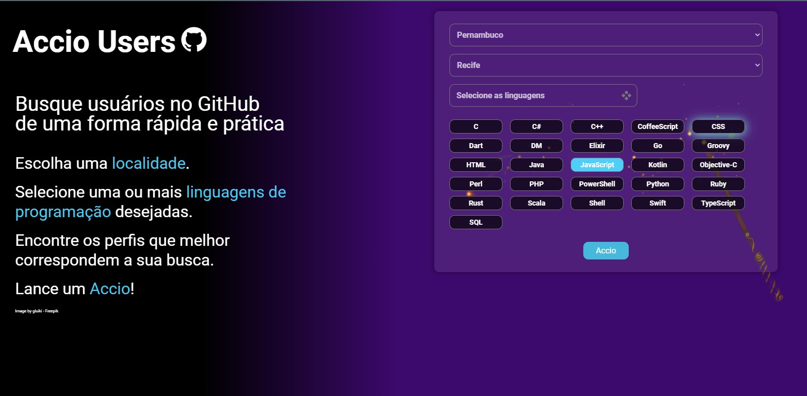
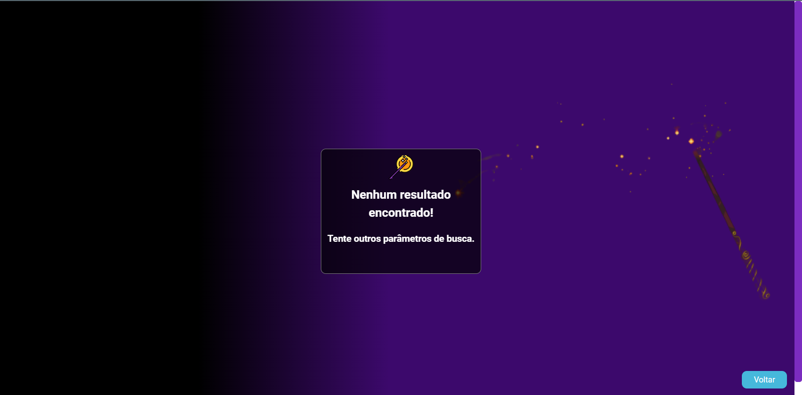

<h1>Accio Users GitHub</h1>

<h2 style="font-family: sans-serif;">Sobre o projeto:</h2>

    O objetivo desse projeto foi desenvolver uma maneira mais <strong style="color: blue;">fácil</strong> de <strong style="color: blue;">pesquisar usuários no GitHub</strong>. Um localizador de usuários com perfis que melhor correspondam a localidade e tipo ou tipos de linguagem de programação escolhidos nos parâmetro de busca. Tornando a experiência de quem busca usuários no GitHub mais <strong style="color: blue;">rápida</strong> e <strong style="color: blue;">prática.</strong>

<h2 style="font-family: sans-serif;">Sobre o Accio Users GitHub:</h2>

  A aplicação é bem simples e intuitiva de usar. Com apenas alguns cliques é possível escolhe a <strong style="color: blue;">localidade</strong> (UF e cidade) e uma ou mais <strong style="color: blue;">linguagens de programação</strong> desejadas.

  Para tal funcionamento foram utilizadas duas API's. A <strong style="color: blue;">API do IBGE</strong> com dados de estados e cidades correspondentes e a <strong style="color: blue;">API do GitHub</strong>  com informações sobre seus usuários.

    Visite a aplicação: <a href="https://accio-user-github.netlify.app/">Accio User GitHub</a>

<h2 style="font-family: sans-serif;">Sobre a ordem dos resultados:</h2>

  Ao informar-mos qual localidade e linguagem de programação queremos e clicarmos no botão <strong style="color: blue;">Accio</strong>, uma requisição será enviada para a API do GitHub que por padrão devolverá os resultados em ordem decrescente começando pela melhores correspondências de acordo com os parâmetros de busca selecionados. Em outras palavras 
  <strong style="color: blue;">do Maior Match para o Menor Match</strong>.

<h2 style="font-family: sans-serif;">Como utilizar os códigos desse repositório:</h2>

    Caso queira utilizar o código presente nesse repositório basta cloná-lo para sua máquina e utilizar o comando npm install no terminal do seu Editor de código para instalar node_modules e suas dependências. Após isso você poderá rodar a aplicação utilizando o comando npm run dev.

<h2 style="font-family: sans-serif;">Linguagens e bibliotecas utilizadas:</h2>

<ul>
    <li>React</li>
    <li>HTML(JSX)</li>
    <li>CSS</li>
    <li>JavaScript</li>
    <li>React Router Dom</li>
    <li>React Toastify</li>
    <li>API IBGE</li>
    <li>API GitHub</li>
</ul>

<h2 style="font-family: sans-serif;">Layout (não responsívo para mobile):</h2>

<h4>Tela inicial</h4>

<h4>Escolhendo Localidade</h4>

<h4>Escolhendo Linguagem</h4>

<h4>Usuários</h4>

<h4>Sem resultados</h4>

 <b><strong style="color: blue;">OBS</strong>.: Ainda não está responsívo em versões mobiles! Novas atualizações em breve</b>

<h2 style="font-family: sans-serif;">Autor</h2>

Lucas Oliveira

<h2 style="font-family: sans-serif;">Links</h2>

<a href="http://www.linkedin.com/in/lucas-de-oliveira-5b8a5532" target="_blank">LinkedIn</a>
 
<a href="https://accio-user-github.netlify.app/" target="_blank">Accio User GitHub</a>
 
